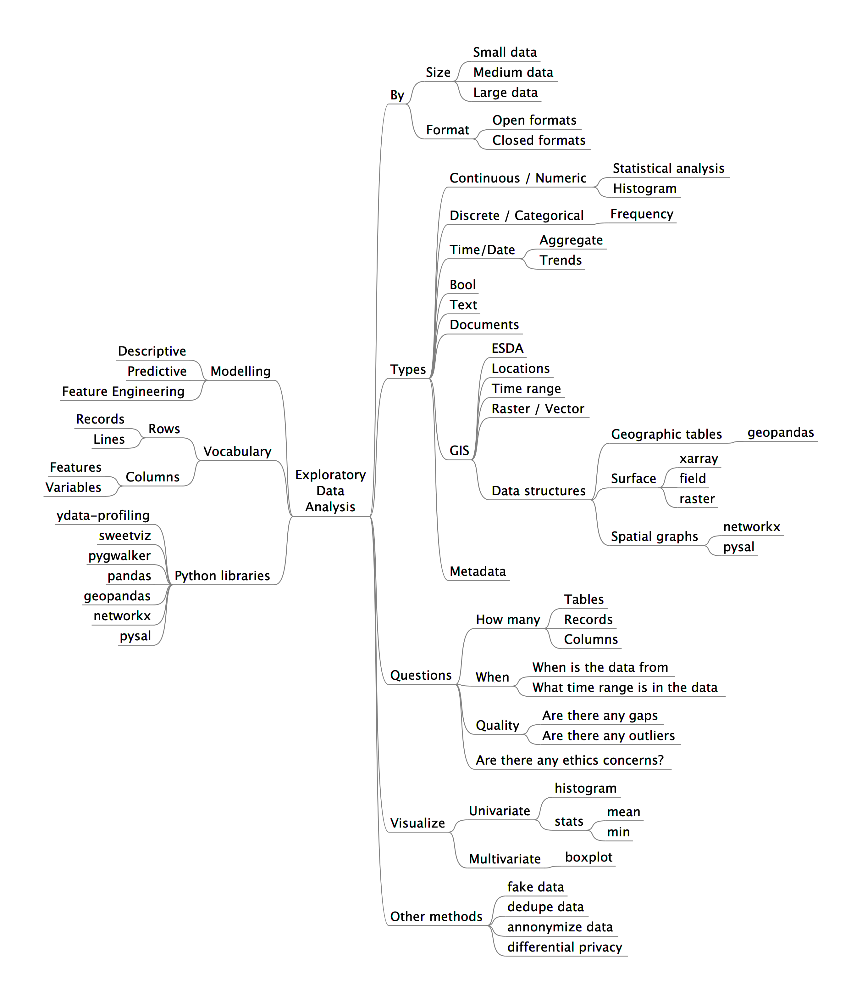

# Exploratory Data Analysis

This repository was prepared for CorrelCon 2023. Slides are available [here](https://docs.google.com/presentation/d/1mYtzt5Tfk_xbYSWUBRgiNH5TumJNUWlRVDMeyntee_w/edit?usp=sharing).

## How to use this repository

You can clone this repository and use it locally as follows.

```bash
git clone https://github.com/darenasc/eda.git
cd eda
pip install pipenv
pipenv install Pipfile
```

Or you can go to the [eda.ipynb](notebooks/eda.ipynb) notebook and open it in Colab.

# EDA Mindmap

Mindmap created with [freeplane](https://docs.freeplane.org).


# Linux commands
Some useful commands for the terminal.

```bash
# Explore directories
ls
# Explore content of files
cat
more
less
head
tail 
wc -l
# Search in files
grep
# Get documentation of commands
man
# Download data or files
wget
curl
# Monitor resources
htop
btop
# Modify files
vim
sed
```

# Python libraries

Some python libraries to explore data.

- [pandas](https://github.com/pandas-dev/pandas)
- [ydata-profiling](https://github.com/ydataai/ydata-profiling) (former pandas-profiling)
- [sweetviz](https://github.com/fbdesignpro/sweetviz)
- [pygwalker](https://github.com/Kanaries/pygwalker)
- [datapane](https://github.com/datapane/datapane)
- [streamlit](https://github.com/streamlit/streamlit)
- [gradio](https://github.com/gradio-app/gradio)
- [geopandas](https://github.com/geopandas/geopandas)
- [pysal](https://github.com/pysal/pysal)
- [networkx](https://github.com/networkx/networkx)
- [word_cloud](https://github.com/amueller/word_cloud)
- [great_expectations](https://github.com/great-expectations/great_expectations)
- [featuretools](https://github.com/alteryx/featuretools)
- [superset](https://github.com/apache/superset)
- [metabase](https://github.com/metabase/metabase)
- [openml-python](https://github.com/openml/openml-python)


-----

<!-- ```mermaid
mindmap
    EDA
        By
            Size
                Small data
                Medium data
                Large data
            Format
                Open formats
                Closed formats
        Type
            Continuous / Numeric
                Statistical analysis
                Histogram
            Discrete / Categorical
                Frequency
            Time/Date
                Aggregate
            Bool
            Text
            Documents
            GIS
                ESDA
                Locations
                Time range
                Raster / Vector
                Data structures
                    Geographic tables
                        geopandas
                    Surface
                        xarray
                        field
                        raster
                    Spatial graphs
                        networkx
                        pysal
            Metadata
``` -->

# EDA Checklist

- What are the formats?
- Are there files with problems? (can't be opened)
- How many files, tables, databases?
- Per item: How many columns and rows?
- Are there any encoding issues?
- Verify data types of columns: Discrete, Continuous, Dates, GIS, network, other.
- Univariate analysis
  - Histogram
  - Bar plot
  - Boxplot
- Multivariate analysis
  - Correlations
  - Use target variable to visualize other features